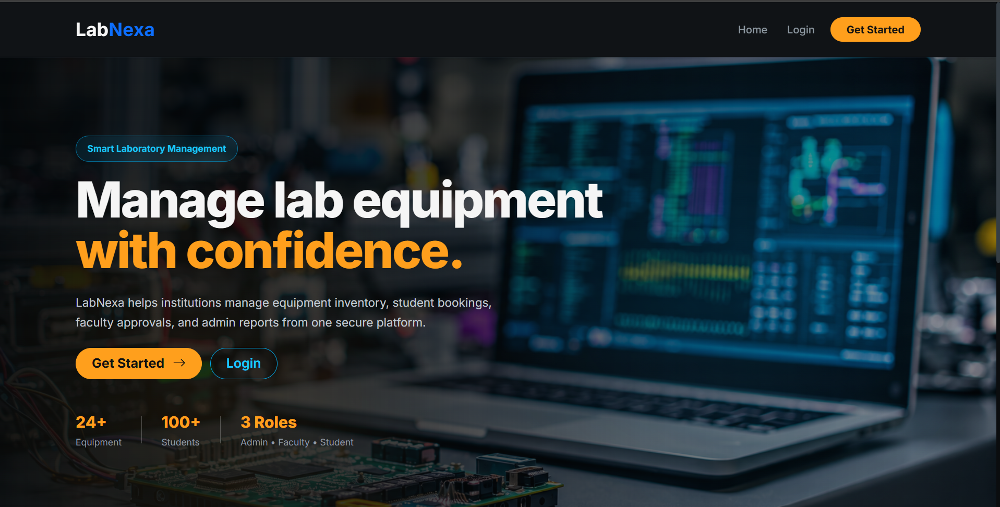
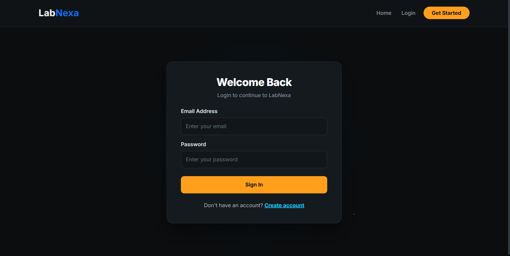
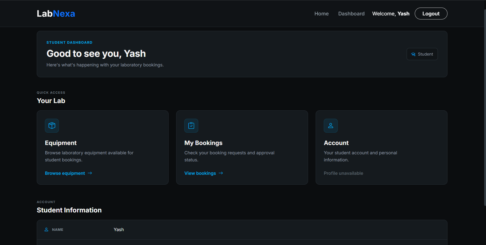
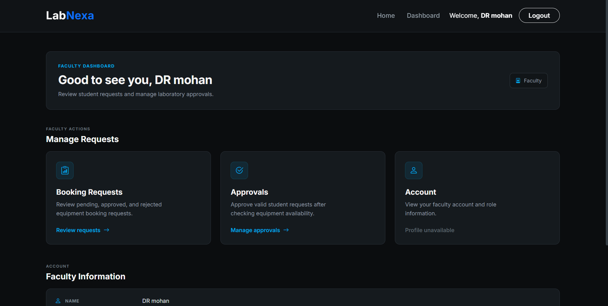
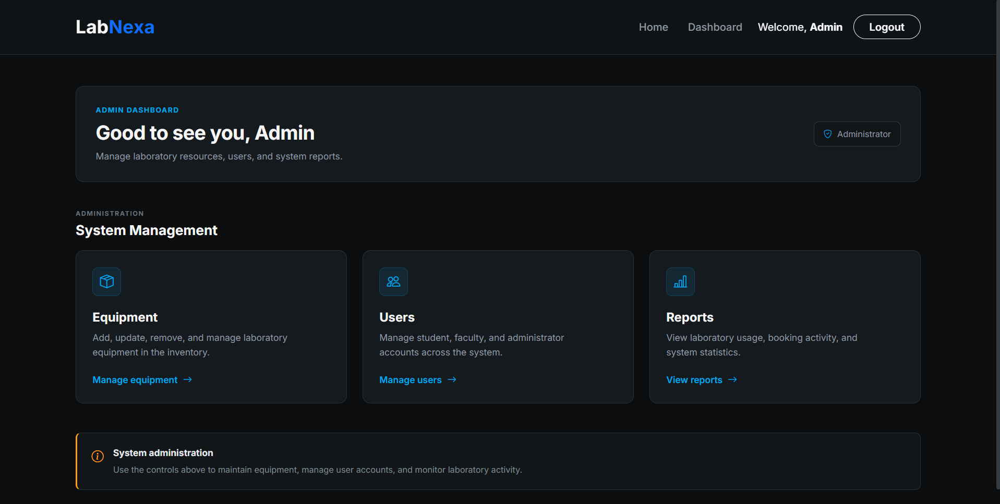
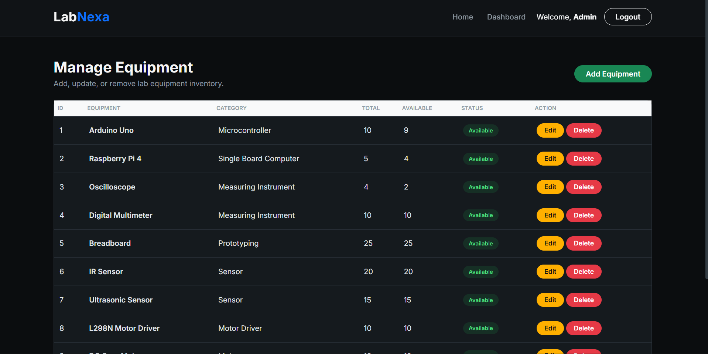
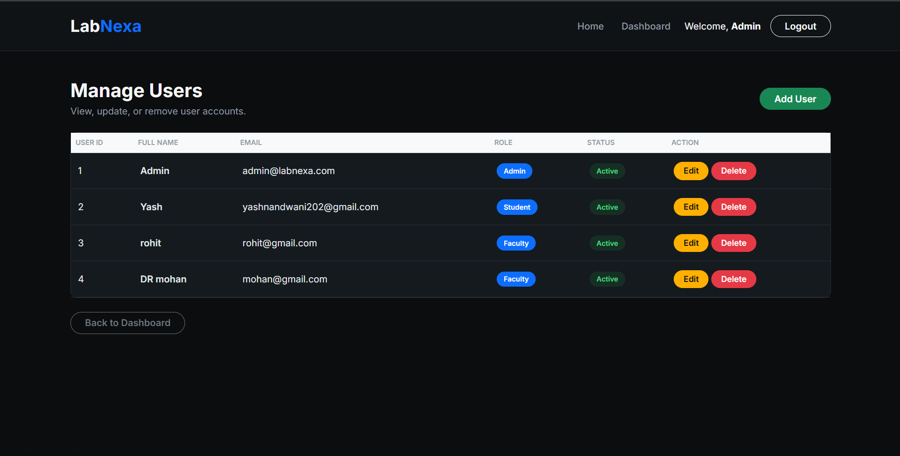
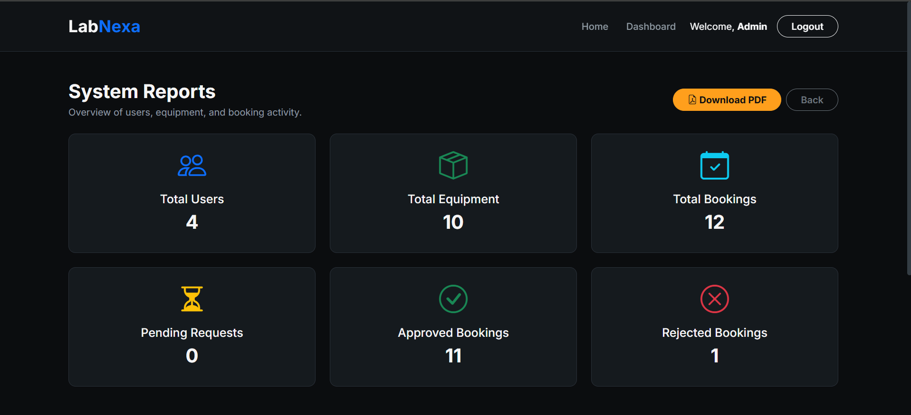
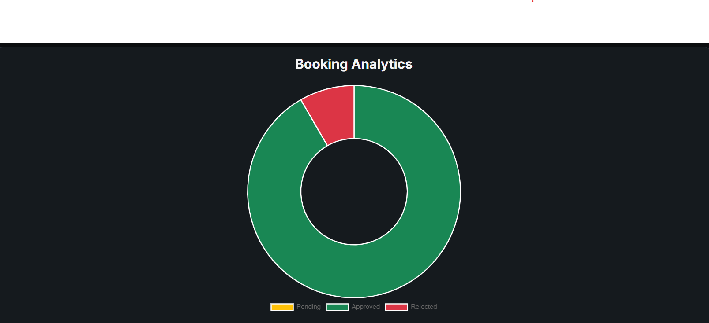
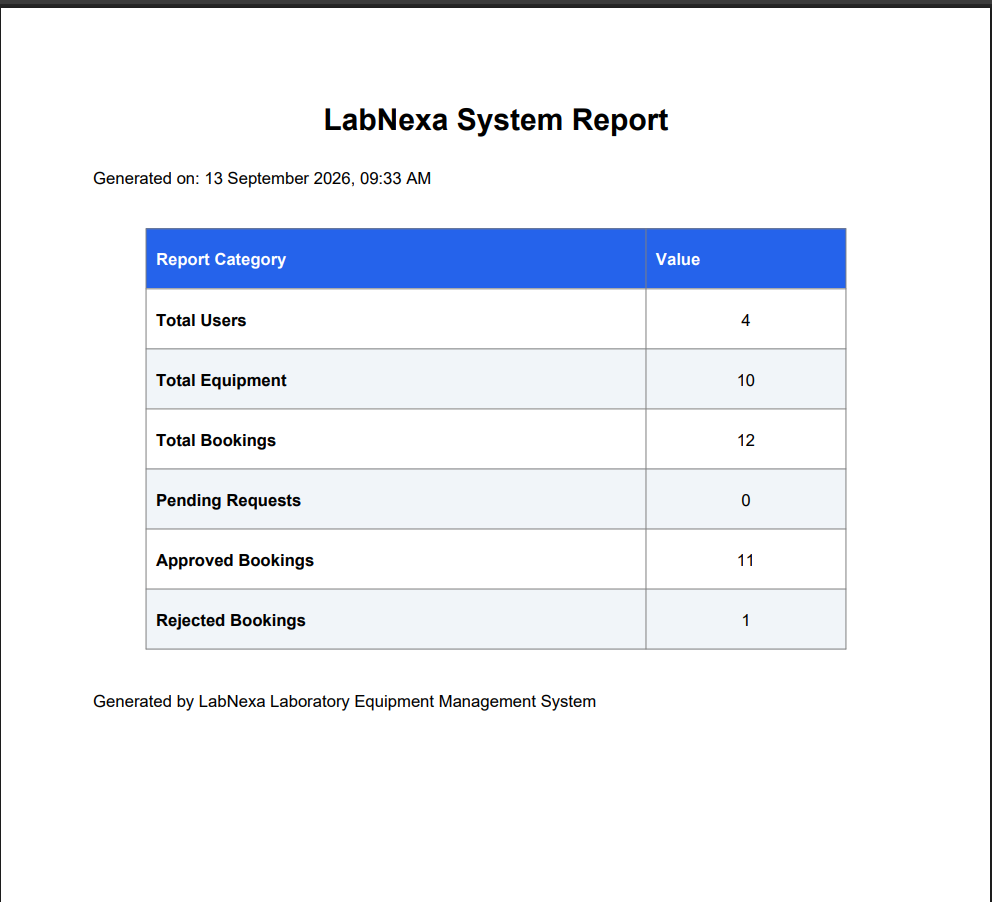

# 🧪 LabNexa

# 🧪 LabNexa

A modern, role-based **Laboratory Equipment Management System** built using **Flask** and **MySQL**.

LabNexa streamlines laboratory equipment booking, approval workflows, inventory management, analytics, and PDF report generation through a clean and responsive web interface.

---

# 📌 Overview

LabNexa is a full-stack web application developed to simplify the management of laboratory equipment in educational institutions.

The system provides separate dashboards and permissions for **Students**, **Faculty**, and **Administrators**, ensuring secure and organized management of laboratory resources.

---

# 🌟 Project Highlights

- 🔐 Secure Authentication with Password Hashing
- 👥 Role-Based Access Control
- 📦 Equipment Management (CRUD)
- 👤 User Management (CRUD)
- 🔍 Equipment Search & Smart Filters
- 📊 Interactive Booking Analytics Dashboard
- 📄 Downloadable PDF Reports
- 📱 Responsive User Interface
- 🛡️ Session-Based Authentication

---

# ✨ Features

## 👨‍🎓 Student Module

- Secure Registration & Login
- Browse Available Equipment
- Search Equipment
- Filter by Category
- Filter by Availability
- Book Laboratory Equipment
- View Booking History
- Track Booking Status

---

## 👨‍🏫 Faculty Module

- Secure Login
- View Equipment Requests
- Approve Booking Requests
- Reject Booking Requests

---

## 👨‍💼 Admin Module

- Admin Dashboard
- Equipment Management (CRUD)
- User Management (CRUD)
- Inventory Management
- View System Reports
- Booking Analytics Dashboard
- Generate PDF Reports

---

# 🔐 Security Features

- Password Hashing using Werkzeug
- Session-Based Authentication
- Role-Based Access Control
- Protected Routes
- Secure Login System

---

# 🛠️ Technology Stack

| Category | Technology |
|----------|------------|
| Backend | Python, Flask |
| Frontend | HTML5, CSS3, Bootstrap 5, Chart.js |
| Database | MySQL |
| Template Engine | Jinja2 |
| PDF Generation | ReportLab |
| Version Control | Git & GitHub |
| Deployment | Render |

---

# 📂 Project Structure

```text
LabNexa
│
├── static
│   ├── css
│   ├── images
│   └── screenshots
│       ├── Homepage.png
│       ├── login.png
│       ├── student-dashboard.png
│       ├── faculty-dashboard.png
│       ├── admin-dashboard.png
│       ├── manage-equipment.png
│       ├── manage-users.png
│       ├── reports.png
│       ├── booking_analytics_chart.png
│       └── pdf_report.png
│
├── templates
│
├── app.py
├── schema.sql
├── requirements.txt
├── .gitignore
└── README.md
```

---

# 📸 Application Screenshots

## 🏠 Homepage



---

## 🔐 Login



---

## 👨‍🎓 Student Dashboard



---

## 👨‍🏫 Faculty Dashboard



---

## 👨‍💼 Admin Dashboard



---

## 📦 Equipment Management



---

## 👥 User Management



---

## 📊 Reports Dashboard



---

## 📈 Booking Analytics Dashboard



---

## 📄 PDF Report Generation



---

# 👥 User Roles

| Role | Responsibilities |
|------|------------------|
| Student | Register, Login, Search Equipment, Book Equipment, View Booking History |
| Faculty | View Requests, Approve Bookings, Reject Bookings |
| Administrator | Manage Users, Equipment, Inventory, Reports & Analytics |

---

# 🌐 Live Demo

The deployed version of LabNexa is available on Render.

**Live Website:**  
https://labnexa.onrender.com

---

# 🚀 Installation

## 1. Clone the Repository

```bash
git clone https://github.com/yashnandwani202-ops/labnexa.git
```

## 2. Navigate to the Project Directory

```bash
cd labnexa
```

## 3. Create a Virtual Environment

```bash
python -m venv venv
```

## 4. Activate the Virtual Environment

### Windows

```bash
venv\Scripts\activate
```

### macOS / Linux

```bash
source venv/bin/activate
```

## 5. Install Dependencies

```bash
pip install -r requirements.txt
```

---

# 🗄️ Database Setup

1. Open MySQL.
2. Create the required database.
3. Import the SQL schema provided in:

```text
schema.sql
```

4. Update the MySQL database configuration inside `app.py` according to your local setup.

Example:

```python
app.config["MYSQL_HOST"] = "localhost"
app.config["MYSQL_USER"] = "root"
app.config["MYSQL_PASSWORD"] = "your_password"
app.config["MYSQL_DB"] = "your_database_name"
```

---

# ▶️ Run the Application

Start the Flask application using:

```bash
python app.py
```

Then open your browser and visit:

```text
http://127.0.0.1:5000
```

---

# 📊 Booking Analytics

LabNexa provides a visual analytics dashboard for administrators to monitor booking activity.

The dashboard uses **Chart.js** to present booking-related statistics in a simple and understandable format.

Features include:

- Booking activity visualization
- Equipment usage insights
- Booking status analysis
- Administrative monitoring

---

# 📄 PDF Report Generation

Administrators can generate downloadable PDF reports using **ReportLab**.

This allows important system information to be exported and maintained for documentation and administrative purposes.

---

# 🔄 System Workflow

```text
Student
   │
   ▼
Search Equipment
   │
   ▼
Submit Booking Request
   │
   ▼
Faculty Reviews Request
   │
   ├── Approve
   │
   └── Reject
   │
   ▼
Booking Status Updated
   │
   ▼
Admin Monitors Reports & Analytics
```

---

# 🧩 Core Functionalities

## Authentication

Users can securely log in to the application based on their assigned role.

Passwords are securely stored using password hashing.

## Equipment Management

Administrators can:

- Add equipment
- Edit equipment
- Delete equipment
- Monitor equipment availability
- Manage inventory

## Booking Management

Students can request laboratory equipment while faculty members can approve or reject booking requests.

## User Management

Administrators can manage system users and maintain organized access control.

## Analytics

The application provides booking analytics to help administrators monitor system usage.

## Reports

PDF reports can be generated for administrative and documentation purposes.

---

# 📁 Important Files

| File | Purpose |
|------|---------|
| `app.py` | Main Flask application |
| `schema.sql` | MySQL database schema |
| `requirements.txt` | Python dependencies |
| `templates/` | HTML templates |
| `static/css/` | CSS files |
| `static/images/` | Application images |
| `static/screenshots/` | Screenshots used in README |
| `.gitignore` | Files ignored by Git |
| `README.md` | Project documentation |

---

# 🎯 Future Improvements

Possible future enhancements include:

- Email notifications for booking approvals
- Equipment maintenance tracking
- QR-code based equipment identification
- Advanced analytics
- Automated inventory alerts
- Improved booking calendar
- Cloud database integration
- More detailed downloadable reports

---

# 🤝 Contributing

Contributions, suggestions, and improvements are welcome.

To contribute:

1. Fork the repository.
2. Create a new branch.
3. Make your changes.
4. Commit your changes.
5. Push the branch.
6. Create a Pull Request.

---

# 📜 License

This project is intended for educational and academic purposes.

---

# 👩‍💻 Project

**LabNexa — Laboratory Equipment Management System**

Built using **Flask, MySQL, Bootstrap, Chart.js, Jinja2, and ReportLab**.